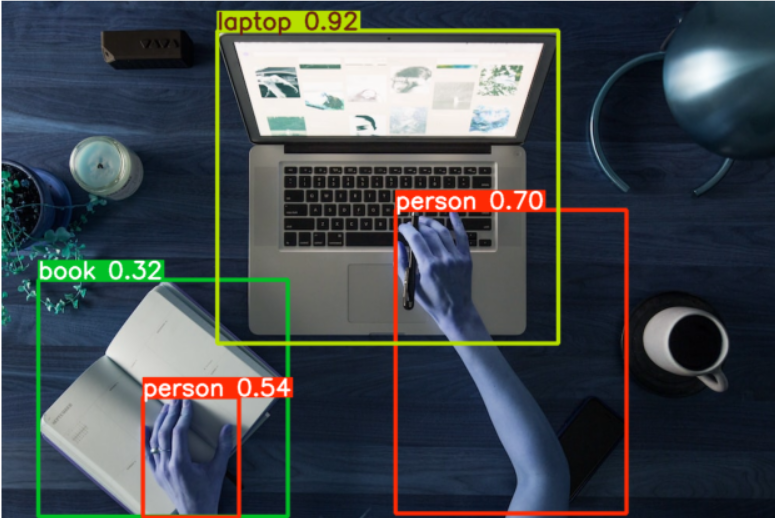

# ObjectDetection_YOLOv8
## ObjectDetectionYOLOv8Samlple
Creating the Object detection code that can detect the objects from the given/Uploaded photo from user using YOLOv8 

The project allows detection of objects in images, videos, and live webcam streams. Bounding boxes and confidence scores are displayed on detected objects.

This project was created as part of my computer vision learning journey and focuses on understanding how object detection pipelines work using modern deep learning models.

### Technologies Used
- Python
- OpenCV
- PyTorch
- YOLOv8
- NumPy

Main libraries:
- ultralytics
- opencv-python

### Features
- Object detection on images
- Object detection on video files
- Real-time webcam detection
- Bounding box visualization
- Confidence score display

### working
The YOLOv8 model processes each frame from an image, video, or webcam feed and predicts:
- Object class
- Bounding box location
- Confidence score

Detected objects are then drawn on the frame using OpenCV.

### Installation
Clone the repository
```
git clone https://github.com/KapX09/ObjectDetection_YOLOv8.git
```
```
cd ObjectDetection_YOLOv8
```
Install dependencies
 ```
   pip install -r requirements.txt
 ```
---
### Demo



